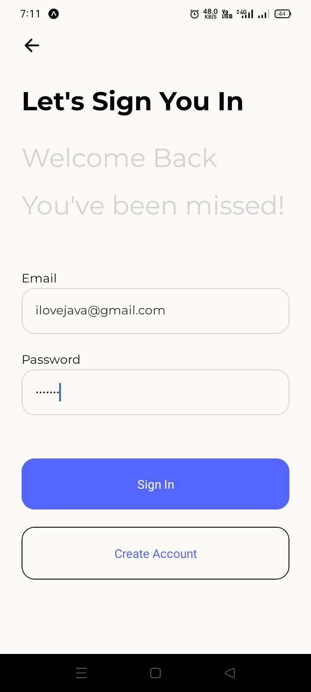
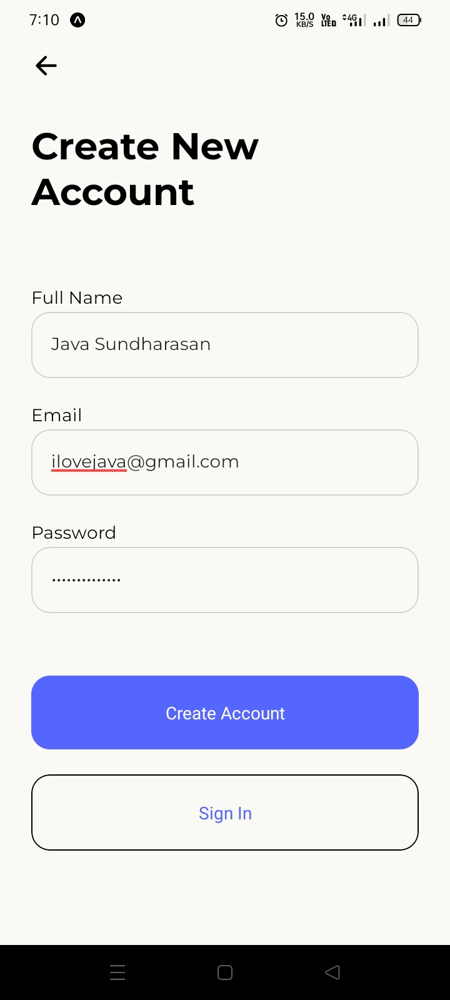
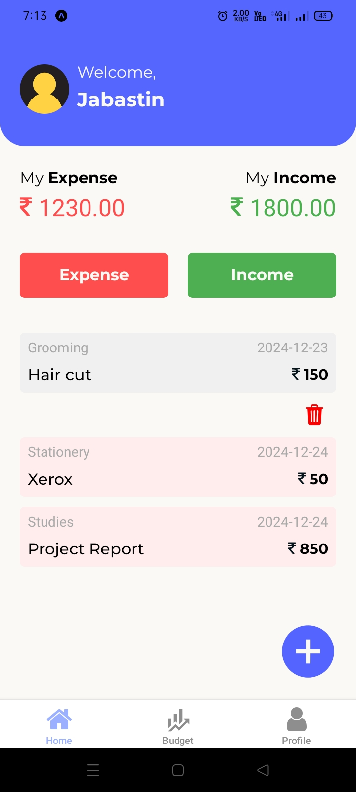
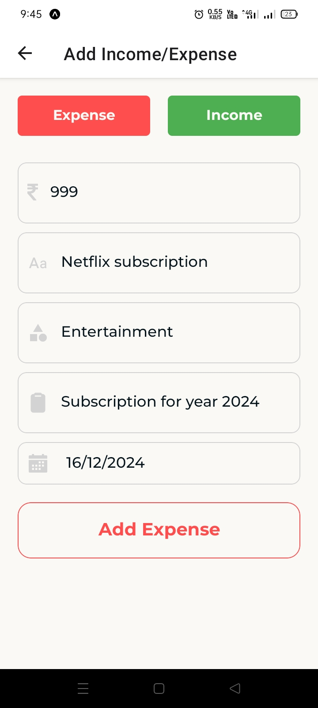
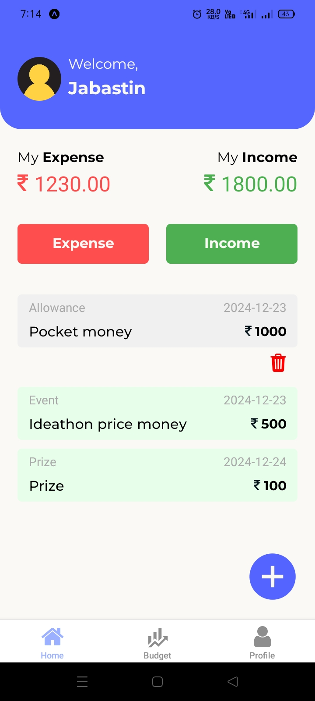
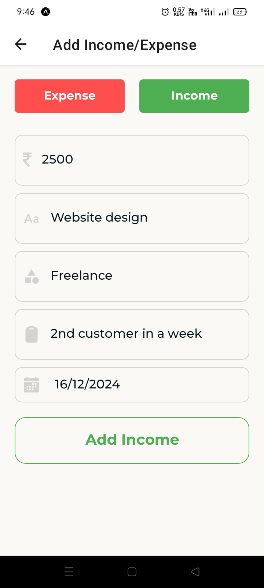
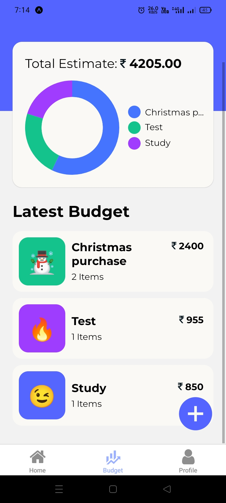
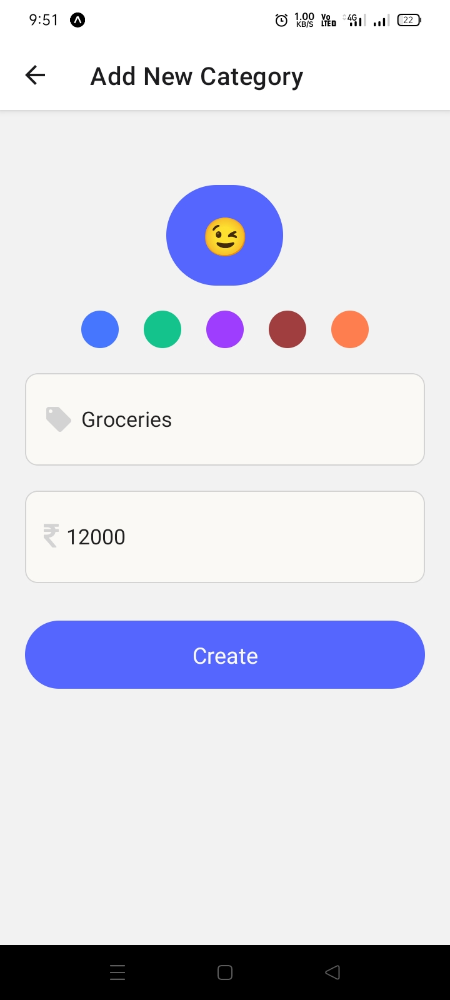
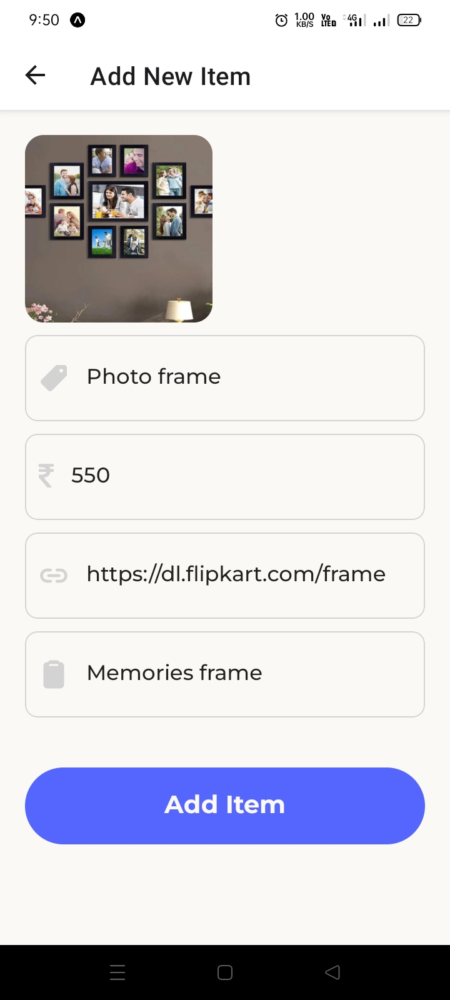
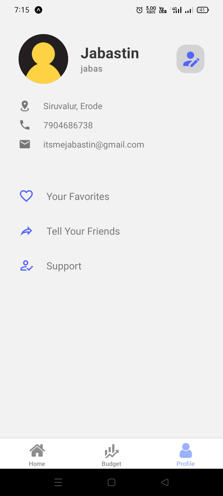

# Budget Tracking System

## Project Overview  
The **Budget Tracking System** is a user-friendly mobile application designed to help individuals manage their finances efficiently. Developed as a mini-project, this app integrates modern technologies to provide an intuitive and seamless experience for budget tracking, expense management, and financial goal setting.


---

## Features  
- **Expense Tracking**: Log and categorize expenses effortlessly.  
- **Budget Management**: Set and monitor monthly budgets.  
- **Authentication**: Secure login and registration powered by Firebase Authentication.  
- **Real-Time Updates**: Responsive and fast user interface for a smooth experience.  

---

## Screenshots  
### 1. Welcome Screen  
 

### 2. Sign In page  
 

### 3. Login Screen  
 

### 4. Home Screen(Expense)
 

### 5. Add Expense
 

### 6. Home Screen(Income)
 

### 7. Add Income
 

### 8. Budget Section  
 

### 9. Create Budget  
 

### 10. Created Budget   
 

### 11. Create Sub-Items  
 

### 12. Profile Section  
 

### 13. Edit Profile Details  
 

---

## Tech Stack  

| Layer            | Technology       |
|-------------------|------------------|
| **Frontend**      | React Native     |
| **Backend**       | Node.js|
| **Database**      | Supabase          |
| **Authentication**| Firebase         |

---

## Installation  

1. Clone the repository:  
   ```bash
   git clone https://github.com/iamJABASTIN/Budget-Tracking-System.git
   cd Budget-Tracking-System
